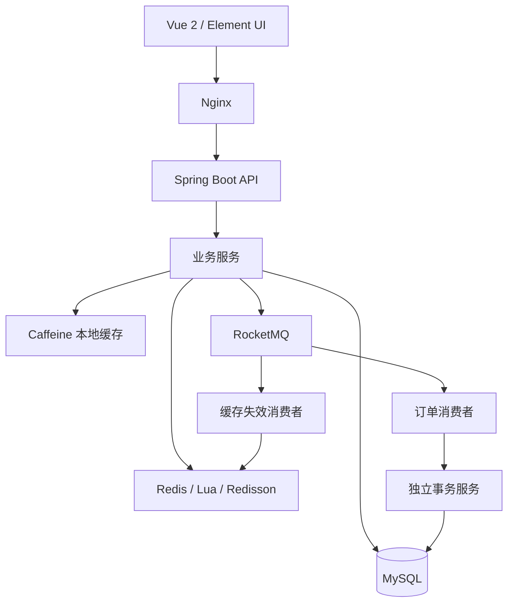

<div align="center">

# Wit Living · 智趣生活

发现附近好店，分享生活日常，让心仪的优惠更近一步。

**城市生活发现 · 探店社区 · 优惠券秒杀**

Java · Spring Boot · MySQL · Redis · Caffeine · RocketMQ · Redisson

</div>

## 项目简介

Wit Living 是一个围绕本地生活场景构建的前后端分离项目，串联商户发现、探店内容、用户互动与优惠券抢购。后端重点围绕两个问题展开：**如何承接热点商户的高频访问，以及如何在并发抢购中协调库存与订单。**

前端采用暖白与森林绿的移动端视觉风格，覆盖商户浏览、探店详情、个人主页和优惠券等页面。

## 核心设计

### 01 · 热点商户的多级缓存

热门商户详情读多写少，重复查询会给数据库带来压力。项目将读取链路组织为：

```text
商户 ID → 布隆过滤器 → Caffeine 本地缓存 → Redis 缓存 → MySQL
```

- **布隆过滤器**：提前拦截确定不存在的商户 ID，减少无效查询。
- **Caffeine + Redis**：本地缓存承接实例内热点，共享缓存减少数据库访问。
- **逻辑过期**：缓存过期时由获取重建锁的请求触发异步更新，其余请求可先读取旧值，减少热点失效时的集中回源。
- **更新失效**：商户更新后清理本机缓存与 Redis，再通过 RocketMQ 触发二次删除补偿。

这套设计侧重商户展示场景的读取可用性，允许短暂旧数据；库存判断则采用独立的原子校验链路。

### 02 · 优惠券秒杀的异步下单

将快速资格判断与数据库落单分开，缩短请求线程中的数据库处理链路。

```text
下单请求
   ↓
Redis Lua：库存校验 + 一人一单校验 + 预扣库存
   ↓
RocketMQ：传递订单消息
   ↓
Redisson 用户锁：同一用户的消费处理互斥
   ↓
独立事务服务：查重 → 条件扣库存 → 写入订单
```

- **原子资格校验**：库存与购买标记在同一 Lua 脚本中处理，避免多条命令之间的并发竞争。
- **异步解耦**：生产者负责提交订单消息，消费者负责数据库落单。
- **重复消费处理**：按用户和优惠券查重，已存在的订单直接返回，避免重复执行下单逻辑。
- **事务边界**：落单逻辑放在独立 Spring Bean 中，库存更新与订单插入处于同一事务。
- **数据库库存保护**：通过 `UPDATE ... WHERE stock > 0` 避免库存被扣成负数。

接口返回订单号表示请求已进入处理链路，实际落单由消费者完成。

### 03 · Redis 支撑的社区互动

围绕具体业务选择数据结构，而不是将所有状态都交给数据库轮询。

| 业务场景 | 实现方式 |
| --- | --- |
| 用户登录 | Redis 保存登录状态，拦截器刷新有效期，ThreadLocal 传递请求内用户信息 |
| 每日签到 | Bitmap 按日期记录签到，结合位运算统计连续签到 |
| 点赞互动 | Sorted Set 记录点赞用户及时间，支持点赞状态与用户列表查询 |
| 关注关系 | 数据库存储关系，Redis Set 支持共同关注查询 |
| 附近商户 | Redis GEO 查询范围内商户，回查详情并附带距离 |
| 关注流 | Sorted Set 保存推送内容，按时间游标滚动查询 |

## 系统架构



## 代码导航

| 模块 | 入口 |
| --- | --- |
| 商户缓存 | [ShopServiceImpl](src/main/java/com/witliving/service/impl/ShopServiceImpl.java) · [CacheClient](src/main/java/com/witliving/utils/CacheClient.java) |
| 秒杀资格与投递 | [VoucherOrderServiceImpl](src/main/java/com/witliving/service/impl/VoucherOrderServiceImpl.java) · [seckill.lua](src/main/resources/seckill.lua) |
| 消费与事务 | [SeckillOrderConsumer](src/main/java/com/witliving/service/SeckillOrderConsumer.java) · [VoucherOrderTransactionService](src/main/java/com/witliving/service/VoucherOrderTransactionService.java) |
| 社区互动 | [BlogServiceImpl](src/main/java/com/witliving/service/impl/BlogServiceImpl.java) · [FollowServiceImpl](src/main/java/com/witliving/service/impl/FollowServiceImpl.java) |
| 登录与签到 | [UserServiceImpl](src/main/java/com/witliving/service/impl/UserServiceImpl.java) |
| 前端页面 | [frontend](frontend) |

## 快速开始

准备 **JDK 8、Maven、MySQL、支持 GEOSEARCH 的 Redis、RocketMQ 与 Nginx**，配置数据库和中间件连接后运行：

```shell
mvn spring-boot:run
```

后端默认端口为 `8081`；前端通过 Nginx 的 `8080` 端口访问，`/api/` 转发到后端。

完整的建库、环境变量、IDEA 配置及验证范围见 [运行与开发说明](docs/DEVELOPMENT.md)。
